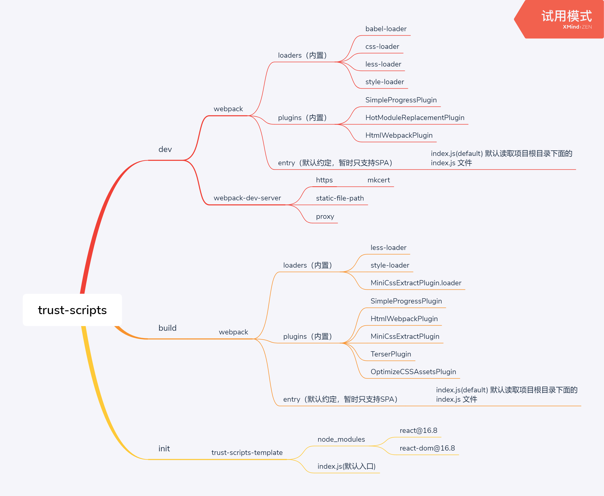

# trust-scripts

A simple webpack scripts for react project.

```bash
npm install -g trust-scripts
```

in your project

```
trust-scripts init
trust-scripts dev
```

## Structure



## Usage

```sh
// dev mode
trust-scripts dev
// prod mode
trust-scripts build
```

## Development

```sh
cd trust-scripts
npm link
trust -V
```

// in your test project

```sh
npm link trust-scripts
trust-scripts dev
// or build
trust-scripts build
```
